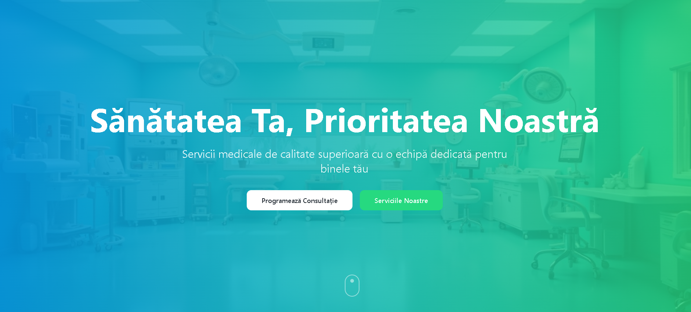

# 🏥 Medix - Modern Medical Clinic Website



**🌐 Live Demo:** [https://iam269.github.io/Medix/](https://iam269.github.io/Medix/)

Welcome to **Medix**! 🌟 A cutting-edge, responsive web application designed for medical clinics to showcase their services, team, and connect with patients. Built with the latest web technologies for optimal performance and user experience.

## ✨ Features

- **🏠 Hero Section**: Eye-catching landing page with compelling visuals and call-to-actions
- **🩺 Services**: Comprehensive display of medical services offered
- **👥 About Us**: Detailed information about the clinic's mission and values
- **📞 Contact**: Easy-to-use contact forms and information
- **👨‍⚕️ Team**: Showcase of medical professionals and staff
- **🔍 Service Details**: In-depth pages for individual services
- **📱 Responsive Design**: Seamless experience across all devices
- **⚡ Fast Performance**: Optimized with Vite for lightning-fast loading
- **🎨 Modern UI**: Beautiful design using Tailwind CSS and shadcn/ui components

## 🚀 Tech Stack

- **⚛️ React 18**: Latest React with hooks and modern features
- **⚡ Vite**: Next-generation frontend tooling for fast development
- **📘 TypeScript**: Type-safe development for better code quality
- **🎨 Tailwind CSS**: Utility-first CSS framework for rapid styling
- **🧩 shadcn/ui**: High-quality, accessible UI components
- **🛣️ React Router**: Client-side routing for SPA navigation
- **🔄 TanStack Query**: Powerful data fetching and caching
- **📝 React Hook Form**: Performant forms with easy validation
- **✅ Zod**: TypeScript-first schema validation
- **🎯 Lucide React**: Beautiful, consistent icons

## 🛠️ Installation & Setup

### Prerequisites
- 📦 Node.js (v18 or higher)
- 🧶 npm or yarn package manager

### Quick Start

1. **📥 Clone the repository**
   ```bash
   git clone https://github.com/yourusername/medix.git
   cd medix
   ```

2. **📦 Install dependencies**
   ```bash
   npm install
   ```

3. **🚀 Start development server**
   ```bash
   npm run dev
   ```

4. **🌐 Open your browser**
   Navigate to `http://localhost:8080` to see the application in action!

## 📜 Available Scripts

- `npm run dev` - Start development server with hot reload
- `npm run build` - Build for production
- `npm run build:dev` - Build for development
- `npm run preview` - Preview production build locally
- `npm run lint` - Run ESLint for code quality checks
- `npm run predeploy` - Prepare for deployment
- `npm run deploy` - Deploy to GitHub Pages

## 🏗️ Project Structure

```
medix/
├── 📁 public/           # Static assets
│   ├── 🖼️ clinic.png    # Clinic logo/image
│   └── 📄 404.html      # 404 error page
├── 📁 src/
│   ├── 📁 components/   # Reusable UI components
│   │   ├── 🏠 Hero.tsx
│   │   ├── 🩺 Services.tsx
│   │   ├── 👥 About.tsx
│   │   ├── 📞 Contact.tsx
│   │   └── 🦶 Footer.tsx
│   ├── 📁 pages/        # Page components
│   │   ├── 🏡 Index.tsx
│   │   ├── 🔍 ServiceDetail.tsx
│   │   ├── 👨‍⚕️ Team.tsx
│   │   └── ❌ NotFound.tsx
│   ├── 📁 hooks/        # Custom React hooks
│   ├── 📁 lib/          # Utility functions
│   └── 🏗️ App.tsx       # Main application component
├── ⚙️ vite.config.ts    # Vite configuration
├── 🎨 tailwind.config.ts # Tailwind CSS configuration
└── 📋 package.json     # Project dependencies and scripts
```

## 🎯 Key Components

### 🏠 Hero Component
- Stunning hero section with background image
- Compelling headline and call-to-action buttons
- Responsive design for all screen sizes

### 🩺 Services Component
- Grid layout showcasing medical services
- Interactive service cards with hover effects
- Links to detailed service pages

### 👥 About Component
- Clinic history and mission statement
- Key values and commitment to patient care
- Professional presentation

### 📞 Contact Component
- Contact form with validation
- Clinic address, phone, and email
- Map integration (if applicable)

### 👨‍⚕️ Team Component
- Staff profiles with photos and bios
- Qualifications and specialties
- Professional layout

## 🚀 Deployment

The application is configured for deployment to GitHub Pages:

1. **🔧 Configure deployment**
   - Update `homepage` in `package.json` with your GitHub repository URL
   - Ensure `vite.config.ts` has correct base path for production

2. **📤 Deploy**
   ```bash
   npm run deploy
   ```

## 🤝 Contributing

We welcome contributions! 🎉

1. 🍴 Fork the repository
2. 🌿 Create a feature branch (`git checkout -b feature/amazing-feature`)
3. 💾 Commit your changes (`git commit -m 'Add amazing feature'`)
4. 📤 Push to the branch (`git push origin feature/amazing-feature`)
5. 🔄 Open a Pull Request

## 📄 License

This project is licensed under the MIT License - see the [LICENSE](LICENSE) file for details.

## 🙏 Acknowledgments

- 🎨 UI components powered by [shadcn/ui](https://ui.shadcn.com/)
- 🎯 Icons from [Lucide React](https://lucide.dev/)
- 🎨 Styling with [Tailwind CSS](https://tailwindcss.com/)
- ⚡ Built with [Vite](https://vitejs.dev/)

## 📞 Support

Need help? Reach out to our development team or open an issue on GitHub!

---

**Made with ❤️ for better healthcare experiences**